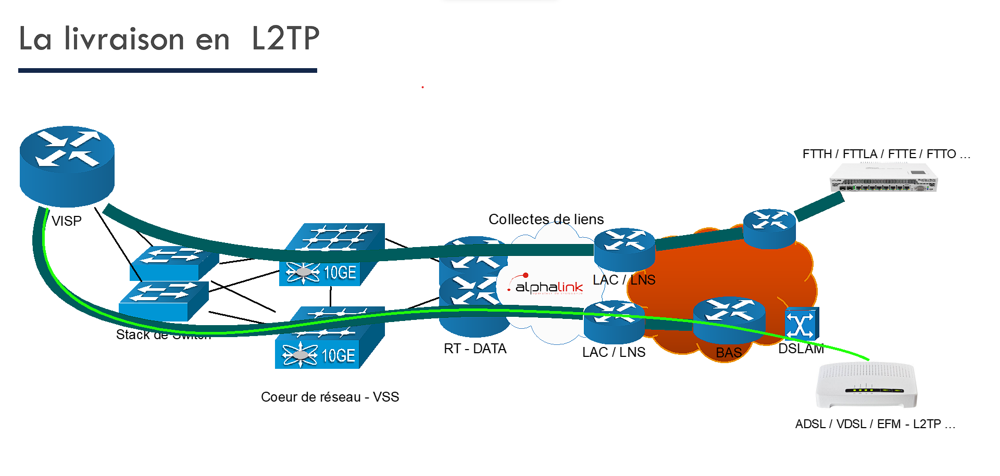
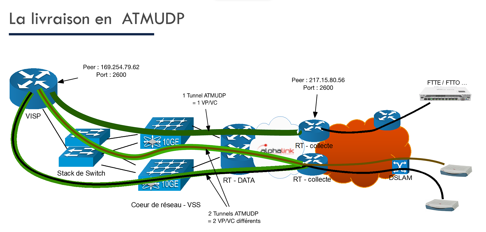
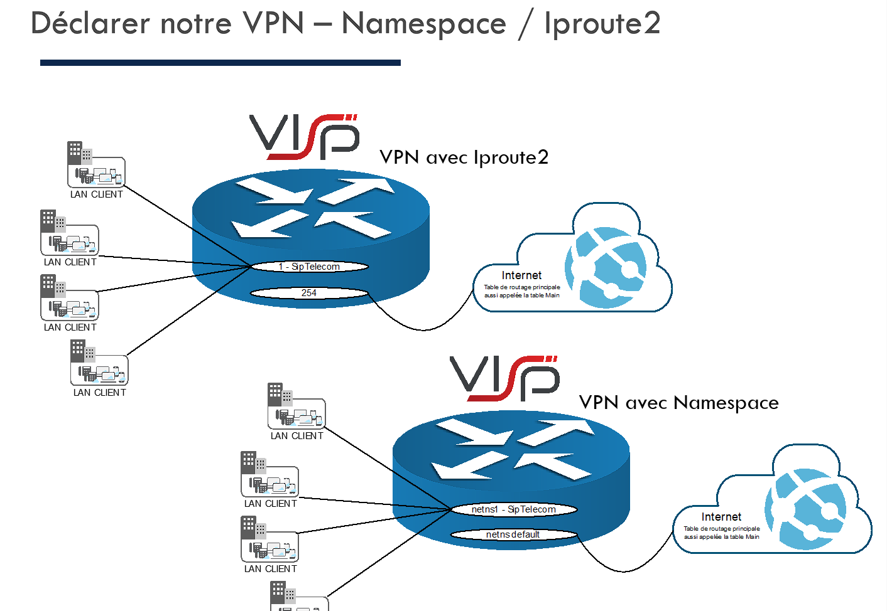
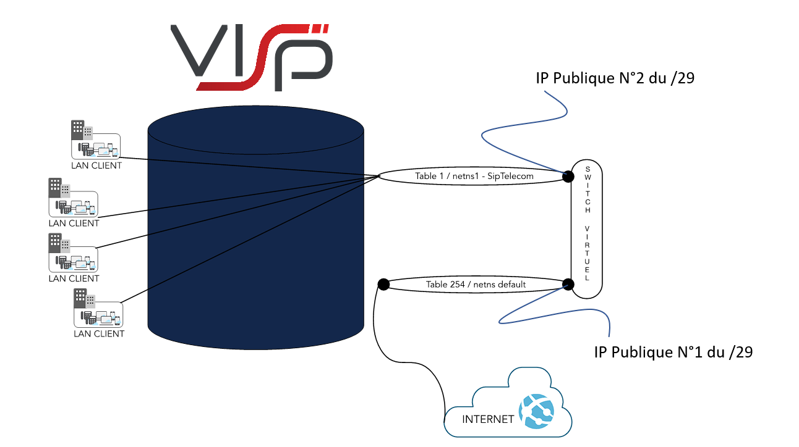

# Documentation VISP 

### Généralitées 

Sauvegarde :

    lisos-snapshots config --description joey

Reinjecter ancienne mise à jour :  (necessite redemarrage)

    lisos-snapshots set "ID"

Upgrade de la VISP :  (necessite redemarrage)

    lisos-upgrade list
    lisos-upgrade set "version exemple:2.11-7"
Downgrade possible en indiquant un numero de version inferieur

### L2TP

Création lien ADSL interface ppp :   (pour login 64 caractères maximum)

    vispprov ppp add -l adsl@formation1.telco -p bonjour -a 10.93.30.111 -m 10.93.30.111 -c "FORMATION JOEY"
    -> interface ppp254001 created
    -> ok

Supprimer un lien L2TP :

    vispprov ppp del -l adsl@formation1.telco
    -> ok 

Consulter le fichier configurations des Users :

    nano-tiny /etc/freeradius/users
    

Déployer limacheck si "-m" n'est pas renseigné dans la commande vispprov -> supervision sur l'extranet :

    nano-tiny /etc/ppp/profiles/"login de la ppp ex: adsl@formation1.telco"

    ->  name ppp254001
    ->  limacheck "ip public"

Pour appliquer les changements :

    /etc/init.d/freeradius restart

freeradius -> authentification des clients 

 

 

### ATMUDP

Ajoût de lien EFM :

    vispprov nas add -a 130.193.30.101/30 -v 217.15.80.54:2600/0/32 -m 130.193.30.102 -c "EFM JOEY"
    -> interface nas254001 created
    -> ok

Première ip -> cote visp 130.193.30.101
Deuxième ip -> cote routeur 130.193.30.102

Modifications du fichiers de configuration des interfaces nas :

    nano-tiny /etc/network/interfaces

Afficher les interface ATMUDP :

    nano-tiny /etc/network/atmudp

    -> utile quand incident sur collecte 

Appliquer les changements limachecks :

    lima-itf stop-conf -i nas254001 ; lima-itf start-conf -i nas254001

Appliquer les changements de /etc/network/interfaces : 

    ifdown nas254001

    -> modifier fichier /etc/network/interfaces 

    ifup nas254001

Supprimer interfaces nas :

    vispprov nas del -d "nom interface nas"

ajouter route static dans /etc/network/interfaces : 

    up ip route add 130.193.30.100/30 via 10.0.0.2 dev nas254001 proto static || true

Afficher route nas254001 qui est sur la table 0 :

    ip r s t 0| grep nas254001

Vérifier l'état de l'interface nas254001 : 

    lima-control check nas254001 dump

 

 

### Agrégats

Création du lien :

    vispprov nas  add --bond -a 169.254.1.9/30 -v 217.15.88.63:2600/0/32 -v 217.15.80.54:2600/0/35 -m 169.254.1.10 -c "BOND JOEY" -r 192.168.3.0/24:169.254.1.10

deux liens physiques en 1 lien logique 
 

### Backup 

Il faut créé l'interface ppp ou nas principale normalement et ensuite créé une deuxieme interface ppp qui correspond à la 4G avec :2 à la fin de la route pour la métric 

Ajout de la route du backup :

    lima_[nom-process] network [reseau-routé-dynamiquement] gw address [ip-routeur-distant]

 

# Multisites 

### VISP 1 et 2 : 

VOIR iproute2
 

### VISP 3 et 4 : 

déclaré namespaces :

    vispprov netns add -n joeyprv -i 1

Entré dans le netns1 : 

    netns netns1
 

 

### Communications intersites :

Il faut créé une interface ppp avec -n "nom du contenaire namespace" sinon créé une interface nas avec -n "nom du container namespace". Ce container est une table de routage privée dans laquelle se trouve les différents sites d'un seul client. 
Pour les interfaces nas il faut declarer la route avec -r "network-client":"ip-interface-exterieur-lien-client"
 
Création vde srv coté netns "default" :

    vispprov netns switch add -s "vde_joey" -a 130.93.30.97/29 -c "formation joey"

Création interafces coté netns1 (privé) :
 
    vispprov netns switch add-itf -s "vde_joey" -n netns1 -a 130.93.30.97/29 -c "formation joey"

 
NAT :  

Pour assurer le nat des flux provenant des tables isolées, nous utiliserons : 
• Avec iproute2 : 
o Le fichier rbnat « etc/network/rbnat » quo est notamment crée lors du passage de
commande de création de la table isolée (avec vispprov rt...) 
• Avec les namespaces : 
o Le fichier « /etc/iptables/netns1-nat.rules.v4 ». 
Voici un exemple de syntaxe avec du SNAT dans le cas de iproute2 qui nous permettra de rendre notre
sortie internet fonctionnelle : 
Dans le cadre des namespace, nous revenons à des règles iptables : 
Pour contrôler la mise en place de nos règles de NAT, nous pouvons : 
• Utiliser la commande « iptables -nvL -t nat » dans le cadre de iproute2 
• Ou la commande « ip netns exec netns1 iptables -nvL -t nat » dans le cadre des namespaces. 

